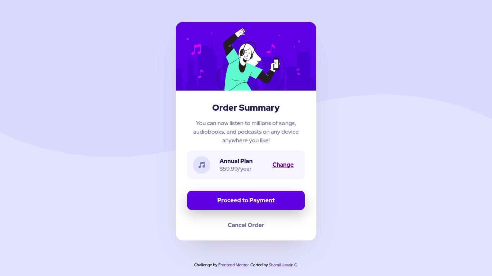

# Frontend Mentor - Order summary card solution

This is a solution to the [Order summary card challenge on Frontend Mentor](https://www.frontendmentor.io/challenges/order-summary-component-QlPmajDUj). Frontend Mentor challenges help you improve your coding skills by building realistic projects.

## Table of contents

- [Overview](#overview)
  - [The challenge](#the-challenge)
  - [Screenshot](#screenshot)
  - [Links](#links)
- [My process](#my-process)
  - [Built with](#built-with)
  - [What I learned](#what-i-learned)
- [Author](#author)

## Overview
Here is my third frontendmentor project. An Order summary component.

### The challenge

Users should be able to:

- See hover states for interactive elements
- Click button and links

### Screenshot

### Links

<!-- - Solution URL: [Add solution URL here](https://your-solution-url.com) -->
- Live Site URL: [https://shamilussainc.github.io/Order-summary-card/](https://shamilussainc.github.io/Order-summary-card/)

## My process

- First developed html body structure
- Started building with mobile first approach
- Used Sass to create css file
- Used flexbox for alignment

### Built with

- Semantic HTML5 markup
- CSS custom properties
- SASS
- Flexbox
- Mobile-first workflow

### What I learned

In this project i have learned to position and change background images based on screen size.

## Author

- Linkedin - [Shamil ussain c](https://www.linkedin.com/in/shamil-ussain-c-893282187/)
- Frontend Mentor - [@shamilussainc](https://www.frontendmentor.io/profile/shamilussainc)
- Twitter - [@c_ussain](https://twitter.com/c_ussain)
